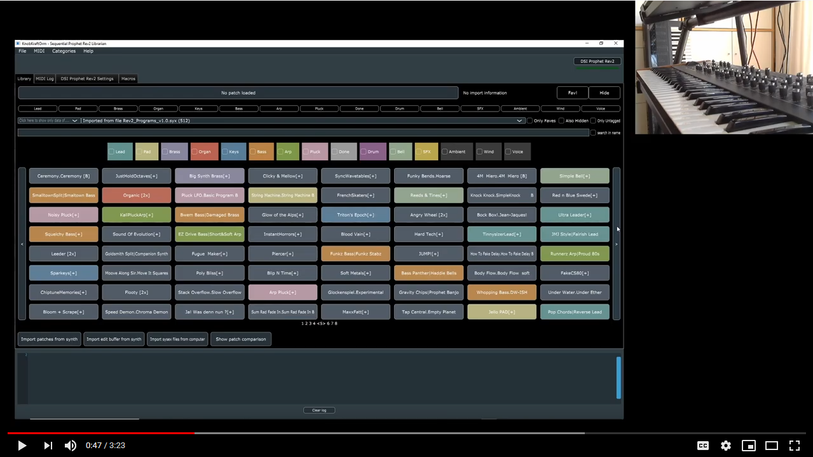

The adaptations are python scripts for a generic module that let's you hook up other MIDI gear yourself, much in the spirit of the good old SoundDiver adaptations - at least, scripting the MIDI. No custom UI currently is possible or planned as of now.

So basically everyone who can read the MIDI spec and can do a little scripting could create new adaptations for more devices!

# How does it look?

[Disclaimer]: The video shows version 1.0.0, a lot has happened since then. Especially the version 2.0.0 introduced the most sought after feature - bank management!

I made a video to show you the software and the most basic functionality, checkout the YouTube channel for more examples and advanced features as well

# Downloading the software

I provide installer builds for Windows and disk images for macOS, they are hosted here in github. To install, just grab the latest installer executable or DMG file from the following page and run it. The Mac version needs to be installed (drag into application folder after opening the DMG) and then run with the CTRL-Click Open command (to ignore unknown source warning, as I do not sign the installers with a certificate).

[https://github.com/christofmuc/KnobKraft-orm/releases](https://github.com/christofmuc/KnobKraft-orm/releases)

Linux is reported to build and run as well, but due to the multitude of possible installations I suggest you follow the build instructions below, it shouldn't be too hard.

You can always use the source to build it yourself, please read on for more instructions.

## Supported platforms

This software is build and run on Windows 10, macOS 10.15, and several Linux distributions. Note that this is not a commercial project, and as I am using Windows mostly expect some hiccups. But I will get back to you if you report a bug and try to resolve it!

## In the press

@mslinn has written a nice intro with some instructions over at the blog, hop over and have a look: https://mslinn.com/av_studio/720-knobkraft.html.
